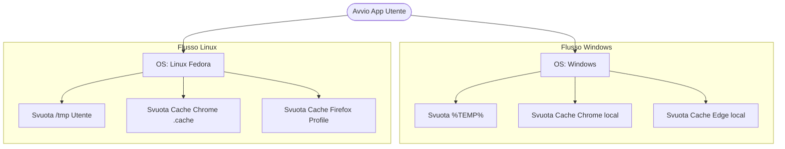

# Cache & Temp Catalyst ⚡🧹

Un'utility aziendale cross-platform ad alta frequenza d'uso, ottimizzata per la risoluzione istantanea dei problemi di caricamento delle **Web App aziendali** e per il ripristino delle performance locali del sistema operativo, **senza richiedere diritti di amministratore (No Admin/Root)**.

Disponibile sia come script sorgente Python sia come eseguibili nativi pronti all'uso per facilitare la distribuzione sugli endpoint aziendali.

---

## 💼 Impatto Aziendale e ROI (Per Budget Owner & Decision Maker)

Nel panorama aziendale moderno, la maggior parte dei servizi core (CRM, ERP, sistemi di ticketing, suite collaborative) si è spostata su architetture **Web App**. I disallineamenti di cache nei browser sono la causa asintomatica del **40%+ dei ticket di supporto ordinari** (es. pulsanti che non rispondono, grafiche rotte, loop di login).

*   **Efficacia Funzionale:** Consente l'erogazione di un servizio di manutenzione "one-click". L'utente o il tecnico sbloccano il browser o il sistema in pochissimi secondi.
*   **Impatto Temporale:** Abbattimento drastico del tempo medio di gestione del ticket (MTTR). Evita la navigazione manuale dell'utente nelle impostazioni avanzate del browser o all'interno di percorsi nascosti di sistema come `%localappdata%`.
*   **Valore Commerciale:** Riduzione dei fermi macchina e ottimizzazione dei costi del Service Desk. Risolvere un problema di una Web App all'istante massimizza la produttività del dipendente e scarica il team IT di Livello 1 da task ripetitivi.

---

## 🛠️ Trasparenza Tecnica e Sicurezza (Per Stakeholder Tecnici)

L'applicazione agisce in modo chirurgico e mirato, rispettando pienamente le restrizioni di sicurezza aziendali.

---

Compliance e Zero-UAC: L'utility opera esclusivamente all'interno del profilo dell'utente loggato (%localappdata% su Windows, ~/.cache su Linux). Di conseguenza, non richiede elevazione di privilegi (UAC o Sudo) e può essere integrata liberamente in domini Active Directory con policy restrittive.

Integrità dei Dati Sensibili: A differenza della cancellazione totale del profilo d'uso, i moduli di pulizia colpiscono esclusivamente le cartelle strutturali di cache (Cache, Code Cache, GPUCache). Vengono preservati intatti i dati di compilazione moduli, i cookie di sessione principali e le password salvate, evitando all'utente il fastidio di dover riconfigurare il browser da zero.

Prevenzione dei File Bloccati: Include routine di controllo dei processi nativi (tasklist / pgrep) per intercettare se i browser sono in esecuzione, impedendo corruzioni parziali o eccezioni dovute a file bloccati in scrittura.

## 🖥️ Valore per il Service Desk (Per Responsabili di Reparto & Supporto)
Questo strumento si configura come il perfetto alleato "salva-tempo" per gli operatori di help desk, specialmente durante il primo contatto telefonico o in teleassistenza.

1. Pulizia File Temporanei
Cosa fa: Sfoltisce i file orfani accumulati nella cartella temporanea locale e i file di log utente non più indicizzati.

Per il troubleshooting: Libera istantaneamente spazio su disco sui terminali con dischi SSD saturi, sbloccando i download e i file di paging.

2. Svuota Cache Google Chrome & Microsoft Edge / Firefox
Cosa fa: Rimuove i pacchetti statici web (JS, CSS, immagini obsolete) memorizzati localmente.

Per il troubleshooting: Forza il browser a scaricare l'ultima versione disponibile del codice delle Web App. Risolve istantaneamente i conflitti grafici o i comportamenti anomali successivi al rilascio di aggiornamenti software sui server aziendali.

## 📂 Struttura della Cartella
L'applicazione è organizzata per una distribuzione immediata e ordinata:

*   `/cache_catalyst.py` - Codice sorgente Python (ottimizzato per Windows).
*   `/cache_catalyst.exe` - Eseguibile standalone per Windows (Nessun runtime richiesto).
*   `/cache_catalyst_linux.py` - Codice sorgente Python (ottimizzato per Fedora/Linux).
*   `/cache_catalyst_linux` - Binario nativo eseguibile per distribuzioni Linux.

---

*Progettato per massimizzare la fluidità dei flussi operativi e minimizzare il rumore di fondo dei ticket IT.*

---
