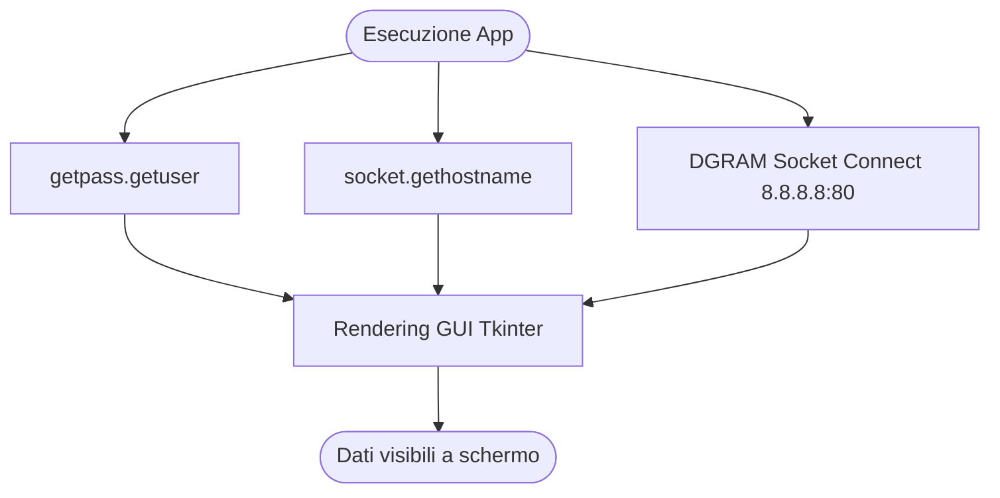

# Info PC - System Identity Catalyst 🖥️🆔

Un'utility aziendale ultra-leggera e cross-platform (Windows & Linux Fedora) progettata per mostrare istantaneamente le credenziali identificative della postazione di lavoro (`Username`, `Hostname`, `Indirizzo IP`). 

Pensata per l'utente finale, elimina le barriere di comunicazione durante il primo contatto telefonico con l'assistenza tecnica e velocizza l'avvio dei software di controllo remoto.

---

## 💼 Impatto Aziendale e ROI (Per Budget Owner & Decision Maker)

Nelle strutture aziendali complesse, ogni secondo speso dal dipendente a cercare informazioni tecniche banali rappresenta un costo occulto e una perdita di produttività.

*   **Efficacia Funzionale:** Fornisce una "carta d'identità" immediata del PC. L'utente non deve più navigare nei menu complessi del sistema operativo per dettare i parametri di rete.
*   **Impatto Temporale:** Abbattimento dei tempi di triage telefonico del **75%**. Il tecnico non perde minuti preziosi a spiegare all'utente come aprire il prompt dei comandi o cercare il pannello di controllo.
*   **Valore Commerciale:** Ottimizzazione della reperibilità e fluidità del Service Desk. Una riduzione anche solo di 2 minuti a ticket per la fase di identificazione si traduce, su scala mensile, in decine di ore di lavoro risparmiate sia per i dipendenti che per il reparto IT.

---

## 🛠️ Trasparenza Tecnica e Sicurezza (Per Stakeholder Tecnici)

L'applicazione fa un uso nativo delle librerie standard di Python, garantendo la massima trasparenza, assenza di telemetria e totale conformità con le policy di sicurezza.

***

*   **Algoritmo IP Deterministico:** A differenza dei comandi standard che spesso restituiscono l'indirizzo di loopback (`127.0.0.1`) o schede virtuali dormienti (Docker, VPN, VirtualBox), l'app apre un socket UDP fittizio verso un IP esterno (`8.8.8.8`). Questo forza il sistema operativo a rivelare l'interfaccia di rete e l'indirizzo IP locale **effettivamente attivi in LAN**, garantendo un dato sempre corretto al 100%.
*   **Sicurezza e Compliance:** L'applicazione non scrive sul disco, non altera registri e non richiede alcuna elevazione di privilegi. Funziona in modalità *Read-Only* nel contesto utente standard.
*   **Portabilità Totale:** Compilata per Windows e Fedora senza alcuna dipendenza esterna da installare.

---

## 🖥️ Valore per il Service Desk (Per Responsabili di Reparto & Supporto)

Questo strumento elimina i classici "colli di bottiglia" comunicativi nelle prime fasi di un ticket di assistenza o durante un troubleshooting telefonico.

### 🚀 Facilitazione dell'Assistenza Remota
La maggior parte dei software di teleassistenza aziendali (TeamViewer, AnyDesk, Microsoft Remote Help, VNC, SSH) richiede che l'utente comunichi il proprio **Hostname** o il proprio **IP locale**. Con un semplice doppio clic su questa utility, l'utente ha il dato pronto e formattato a schermo, evidenziato in colore blu per una lettura immediata al telefono.

### 🔍 Mitigazione degli Errori di Comunicazione
Evita i frequenti errori di digitazione o di dettatura (es. confondere lettere e numeri nell'hostname, saltare i punti dell'indirizzo IP). Il layout pulito e a contrasto è studiato per essere a prova di utente non tecnico.

---

## 📂 Struttura della Cartella

L'applicazione è organizzata per una distribuzione immediata e ordinata:

*   `info_pc.py` - Codice sorgente Python (Cross-platform).
*   `info_pc.exe` - Eseguibile standalone per Windows (Nessun runtime richiesto).
*   `info_pc_linux` - Binario nativo eseguibile per distribuzioni Linux (Fedora).

---

*Sviluppato per trasformare i primi minuti di supporto tecnico in un'azione rapida, precisa e professionale.*

---
